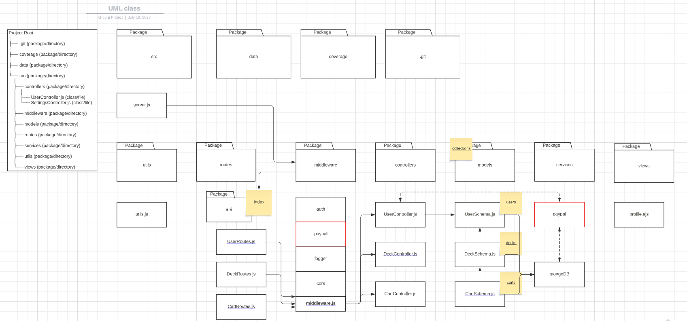
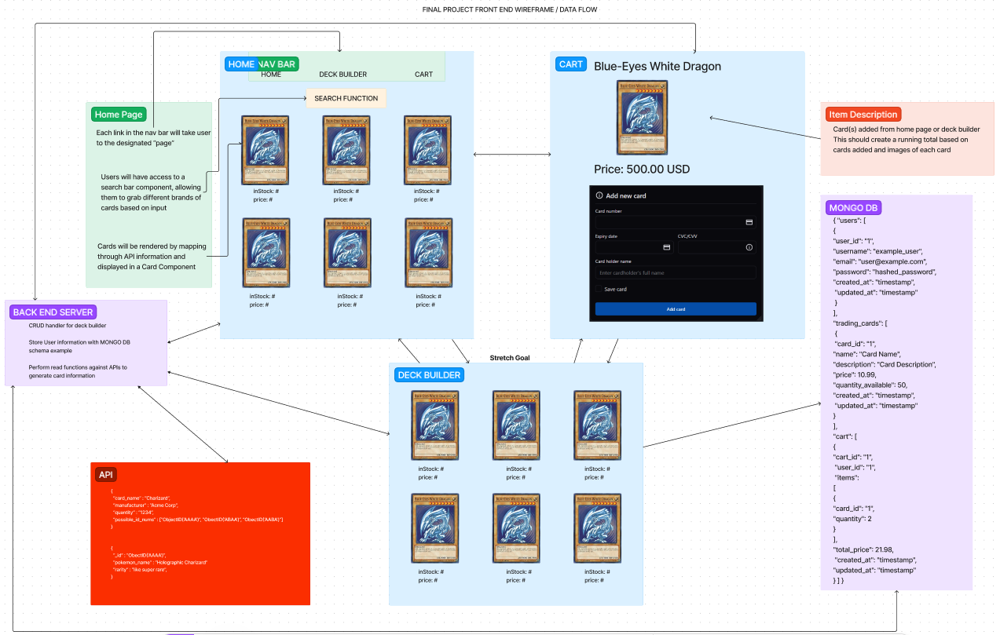
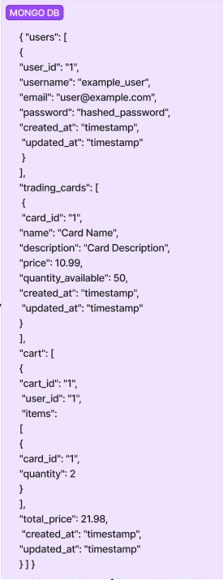

# Software Requirements

## Vision

_What is the vision of this product?_

**The vision of our product is to develop an e-commerce website to allow users to search cards, create decks, and purchase cards/decks. We want to be able to pull in API data on the cards from different brands varying from Pokemon, Yu-gi-oh, and Magic the gathering as some examples. Creating a centralized card "purchase market" for all the different brands of card is the major focus.**

_What pain point does this project solve?_

**The pain point we are aiming to resolve is a centralized market of cards. Primarily card markets focus on a specific category such as sports or a specific brand such as Pokemon. We aim to create an application that allows for "battle style" genre of cards to all be in one place. This would allow new card collectors to build decks of their cards they would like to attain and see a price point needed or just allow for the discovery of new cards through exploration of the website.**

Scope (In/Out)

    IN:
    - The web app will provide card information to users from varying brands.
    - The web app will allow users the ability to search specific cards, such as Pokemon or Magic the Gathering.
    - Users will be able to add cards to a shopping cart to see a cost associated with multiple cards.
    - The web app will allow for secure login to allow users to retain their carts based on login information.
    - The web app will utilize Stripe as a purchase package for conveience and security.

    OUT:
    - Our web application will never sell user information.

Minimum Viable Product vs

_What will your MVP functionality be?_

**Our MVP for our web application would be a bare bones front end with basic components to allow users to see the card information coming from the different APIs while the backend would just be providing the different API information.**

_What are your stretch goals?_

**Fully functioning cart utilizing Stripe for purchases.**

**User deck creation to allow for persistent data management tied to unique users.**

_What stretch goals are you going to aim for?_

**Ideally we want to hit all of our stretch goals**

## Functional Requirements

    A user can generate a card deck tied to their unique user id.
    A user can update their cart by adding or removing cards from it.
    A user can search all of the products in the inventory.
    A user can purchase cards placed within their cart through Stripe.

## Data Flow

_Back End Data Flow_

_Front End Wire Frame and Data Flow_

When a user selects a card to be placed in the deck builder we will pass the unique id information to the deck builder page and render it in another card component with all the information displayed from the home page. If the user decides to add the card to the cart, they will be able to do so with button functionality on each of the cards. Either action will trigger an update to the user information in the MongoDB to be updated to persist the data of the deck or cart for that specific user. The APIs should generate on page load and may use a cache/cookie system to hold information for a certain period of time to prevent multiple API calls. Information within MongoDB will need to be removed as cart or deck builder is modified as well.

_DB Schema Diagram_

We intend to use MongoDBs flexibility in data storage to not set our data up as tables. We want to allow user data to be stored as the above diagram represents, with information for the cart deckbuilder and user information being stored in one large object with arrays holding information for the individual categories based on what is being updated/added/deleted. This concept may be changed if the relational style of holding data is a better route for management. Data that we will be housing will be the username, email, password in the first array. The deck-builder array will hold the card id, name, description, price and instock numbers. Finally the cart array will hold the cart id, user id, items and total price of all items.

## Non-functional requirements

\*\*Our application will have testing, with the goal of above 80% coverage. We will need to write tests in multiple locations to test for DB creation, update, deletion, and read functionality. Since we intend on using MongoDB we will need to work out a specific testing parameter to generate and delete this data as testing is conducted. As well as testing the functionality on the front end to ensure our application is displaying information correctly.

\*\*Another non-functional requirement will be security. We intend to allow users the opportunity to purchase cards through Stripe, so we will need to ensure security with payment information and user information. We intend on accomplishing this by utilizing Auth O and the embedded security measures within Stripe. We also intend on looking into ways to possible test these security measures to ensure there is no leaks of information"
